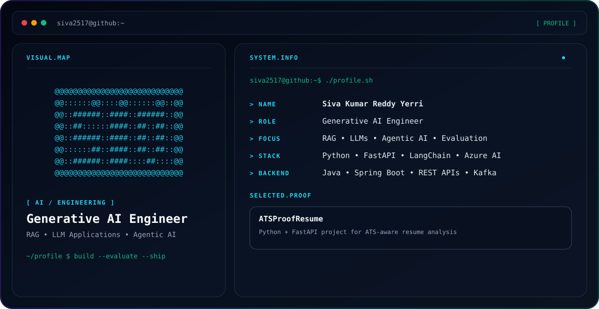

<picture>
  <source media="(prefers-color-scheme: dark)" srcset="./dark.svg">
  <source media="(prefers-color-scheme: light)" srcset="./light.svg">
  
</picture>

# Hi, I'm Siva Kumar Reddy Yerri 👋

**Generative AI Engineer focused on RAG, LLM applications, document intelligence, evaluation, and agentic AI.**

I build production-oriented AI applications with **Python, FastAPI, LangChain/LangGraph, Azure AI Search, Azure Document Intelligence, Qdrant, PostgreSQL, and Redis**, backed by backend engineering experience with **Java, Spring Boot, REST APIs, Kafka, Docker, and CI/CD**.

## Focus
- Generative AI and LLM applications
- Retrieval-Augmented Generation (RAG)
- Agentic AI and corrective RAG workflows
- Prompt engineering and LLM evaluation
- Vector / hybrid retrieval and metadata filtering
- Document intelligence and structured extraction
- Production-oriented Python / FastAPI services

## Engineering Stack
**AI / GenAI:** LLMs, RAG, Agentic AI, LangChain, LangGraph, Prompt Engineering, Embeddings  
**Retrieval:** Azure AI Search, Azure Document Intelligence, Qdrant, Vector Search, Hybrid Search  
**Backend:** Python, FastAPI, Java, Spring Boot, REST APIs, SQL  
**Data / State:** PostgreSQL, Redis, Kafka  
**Frontend:** React, TypeScript  
**Engineering:** Docker, GitHub Actions, CI/CD, Azure, Git

## Featured Projects

### [Agentic RAG Copilot](https://github.com/siva2517/agentic-rag-copilot)
Production-oriented agentic RAG system using **LangGraph, FastAPI, Qdrant, PostgreSQL, Redis, hybrid retrieval, corrective RAG, structured citations, async ingestion, and evaluation**.

### [RAG Document Intelligence](https://github.com/siva2517/rag-document-intelligence)
Enterprise document intelligence platform for contracts, RFPs, and policies with **cited Q&A, requirement extraction, LLM council review, PDF highlighting, ground-truth comparison, FastAPI, Qdrant, and React**.

### [ATSProofResume](https://github.com/siva2517/ATSProofResume)
Python/FastAPI application for analyzing job descriptions, optimizing resumes for ATS alignment, and generating structured job-application support.

## Education
- **DBA, Data Science Concentration** — Belhaven University, in progress
- **M.S. in Data Science** — Sacred Heart University
- **B.Tech in Electronics & Communication Engineering** — Lovely Professional University

## Connect
- [LinkedIn](https://www.linkedin.com/in/sivayerri)
- [GitHub](https://github.com/siva2517)
